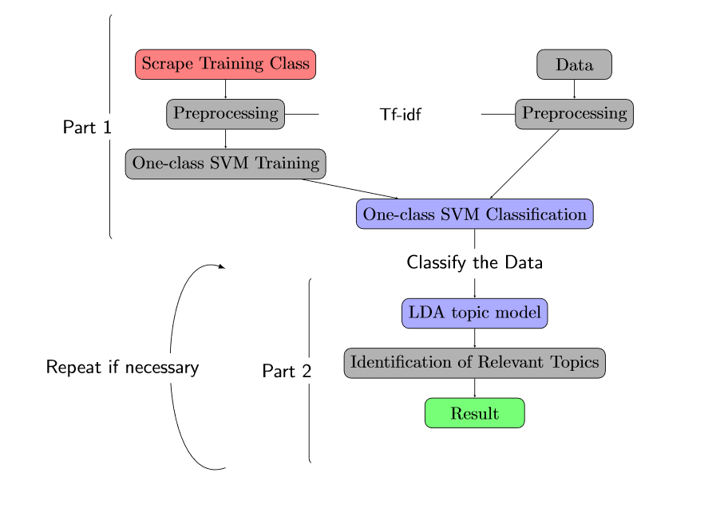

---
title: 'AuDoLab: Automatic document labelling and classfication for extremely unbalanced data'
tags:
  - Python
  - One-class SVM
  - Unsupervised Document Classification
  - One-class Document Classification
  - LDA Topic Modelling
  - Out-of-domain Training Data
authors:
  - name: Arne Tillmann^[Custom footnotes for e.g. denoting who the corresponding author is can be included like this.]
    orcid: 0000-0003-0872-7098
    affiliation: 1
  - name: Anton Thielmann
    affiliation: 1
  - name: Christoph Weisser
    affiliation: 1,2
  - name: Benjamin Säfken
    affiliation: 1,2
  - name: Alexander Silbersdorff
    affiliation: 1, 2
  - name: Thomas Kneib
    affiliation: 1,2
affiliations:
 - name: Georg-August-Universität Göttingen, Göttingen, Germany
   index: 1
 - name: Campus-Institut Data Science (CIDAS), Göttingen, Germany
   index: 2
date: 24 April 2021
bibliography: paper.bib

# Optional fields if submitting to a AAS journal too, see this blog post:
# https://blog.joss.theoj.org/2018/12/a-new-collaboration-with-aas-publishing
aas-doi: 10.3847/xxxxx <- update this with the DOI from AAS once you know it.
aas-journal: Astrophysical Journal <- The name of the AAS journal.
---

# Summary

AuDoLab provides a novel approach to one-class document classification for heavily imbalanced datasets, even if labelled training data is not available.
Our package enables the user to create specific out-of-domain training data to classify a heavily underrepresented target class
in a document dataset using a recently developed integration of Web Scraping, Latent Dirichlet Allocation Topic Modelling and One-class Support Vector Machines [@Thielmann]. AuDoLab can achieve high quality results even on higly specific classification problems without the need to invest in the time and cost intensive
labelling of training documents by humans. Hence, AuDoLab has a broad range of scientific research or business applications. The following section provides an overview of AuDoLab. AuDoLab can be installed conveniently via pip. A detailed description of the package and installation and can be found in the packages repository or on the documentation website (link).

# Statement of need

Unsupervised document classification is mainly performed to gain insight into the underlying topics of large text corpora.
In this process, highly underrepresented topics are often overlooked and consequently assigned to the wrong topics.
Thus, labeling underrepresented topics in large text corpora is often done manually and can therefore be very time-consuming.
AuDoLab enables the user to tackle this problem and perform unsupervised one-class document classification for heavily underrepresented document classes.
This leverages the results of one-class document classification using One-class Support Vector Machines (SVM) [@Scholkopf] [@Manevitz] and extends them to the use case of severely imbalanced datasets.
This adaptation and extension is achieved by implementing a multi-level classification rule as visualised in the graph below.

{ width=100% }

The first part of the package enables the user to web scrape training documents (scientific papers) from IEEEXplore. The user can search for multiple search terms and specify an individual search query. Thus, an individually labelled (e.g. via author-keywords) training data set is created. Through the integration of pre-labelled out-of-domain training data, the problem of the heavily underrepresented target class can be circumvented, as large enough training corpora can be automatically generated.
Subsequently, the text data is preprocessed for the classification part. The text preprocessing includes common NLP text preprocessing techniques such as stopword removal and lemmatization.  As  document  representations  the  term  frequency-inverse  document  frequency  (tf-idf) representations are chosen. The tf-idf scores are computed on a joint corpus from the web-scraped out-of-domain training data and the target text data.

The second and main part of the classification rule lies in the training of the one-class SVM [@Scholkopf]. As a training corpus, only the out-of-domain training data is used.  By adjusting hyperparameters, the user can create a strict or relaxed classification rule, that reflects the users belief about the prevalence of the target class inside the target data set and the quality of the scraped out-of-domain training data. The last part of the classification rule enables the user to control the classifiers results with the help of LDA topic models [@Blei] (and e.g. wordclouds). Additionally, the user can generate interactive plots depicicting the identified topics during the LDA topic modelling [@ldavis].

The second step can be reiteraded, depending on the users perceived quality of the classification results.

## Comparison with existing tools

At the moment no Python Package with a comparable functionality of AuDoLab is available, since AuDoLab is based on a novel and recently published classification prodcedure [@Thielmann].
Thereby, AuDoLab uses and integrates in particular a combination of Web Scraping, Topic Modelling and One-class Classifcation for which various individual packages are available. For Topic Modelling available packages are the LDA algorithm as implemented in the package Gensim [@rehurek_lrec] or the package TTLocVis [@Kant2020] for short and sparse text. Visual representations of the topics can be implemented with [@ldavis] or [@chaney2012visualizing]. The One-class SVM classification package is availabe in Scikit-learn [@scikit-learn]. 

# Acknowledgements

We thank the Campus-Institut Data Science (CIDAS), Göttingen, Germany for funding this project.

# References
